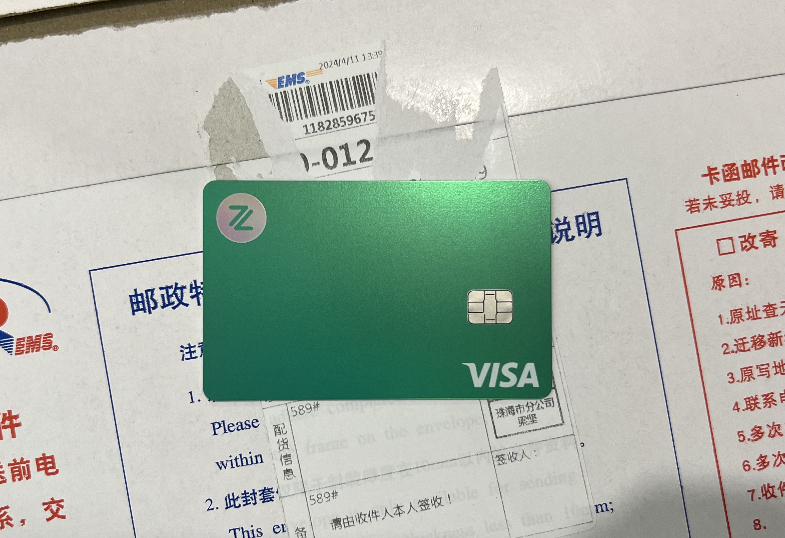

# 众安银行

## 🎉结果
众安银行，虚拟银行，ZA Bank APP操作。3月31日22:10提交开户，4月4日19:39开户审批通过，4月9日申请实体卡 ZA Card，4月11日EMS珠海寄出，4月13日收卡激活。  

## 📜我准备的材料
✅ 身份证  
✅ 港澳通行证  
✅ ZA Bank APP  
✅ 大陆手机号  
✅ 常用电子邮箱  
✅ 移民局12367小程序  
✅ 香港酒店WIFI

## 📽️开户过程
➡️ 连接酒店WIFI，进入 ZA Bank 手机APP，按流程指引开户即可，账户会提供一张 Visa 虚拟卡和实体卡、可以定制卡号最后6位。  
➡️ 流程指引很详细，主要是手机号、邮箱填写，证件录入，个人信息填写，出入境记录上传。   
➡️ 同步申请了投资账户，会填写投资问卷，按实际情况填写。  
➡️ 提交后进入审批。  
➡️ 审批通过后登录 ZA Bank APP，可以申请 Visa 实体卡，需要支付 25港币费用，EMS珠海寄出，APP 上可以看到申请、制卡、邮寄时间的记录。 

## ❗补充说明
1️⃣ 出入境记录在微信小程序"移民局12367"，路径：中国公民服务 -> 出入境记录查询 -> 选择查询人/查询时间 -> 证件列表 -> 发送邮箱。发送提交时按APP开户指引设置密码；  
2️⃣ 出入境记录不是实时同步，会有延迟，在入境香港30分钟之后再尝试查询，离港后不影响开户审批；  
3️⃣ 大陆手机号开通漫游功能，以方便在香港接收短信；  
4️⃣ 在手机上登录电子邮箱(APP、微信通知等渠道)，以方便接收电子邮件；  
5️⃣ 香港公共区域基本都有免费WIFI，地铁、银行、商场等，有些连接后需要验证并限制时长，不过开户够用了。手机开通了漫游流量包、本地流量包或者香港流量卡，也可以直接使用流量；  
6️⃣ 我的邀请码 A69846 

## 📸图片
### 众安银行 Visa 实体卡
