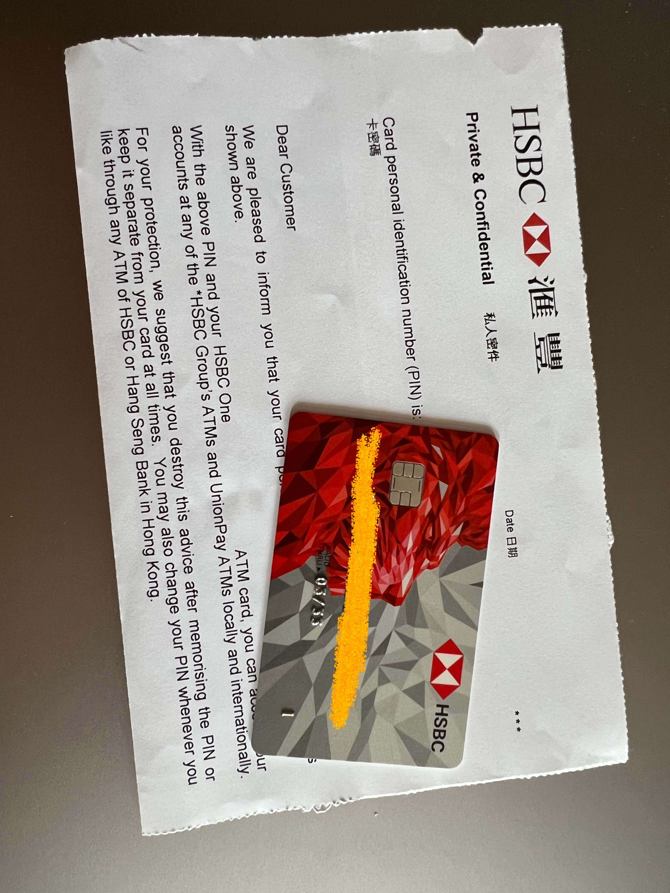
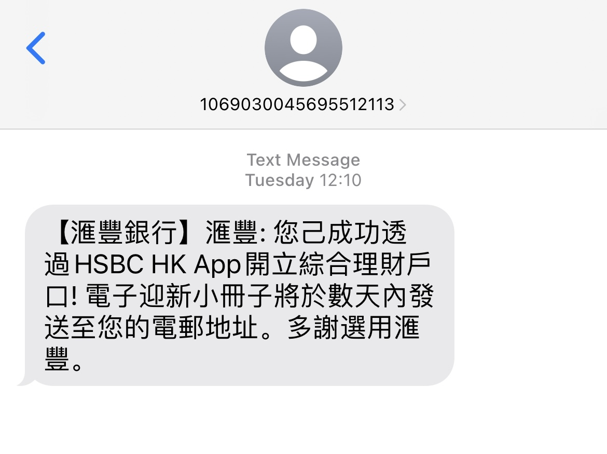
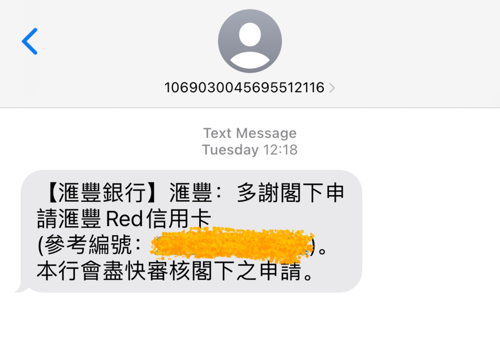

# 香港汇丰

## 🎉结果
香港汇丰，荃湾分行，4月2日walk-in开户。排队等待1小时40分钟左右，40分钟开户完成，同步申请Red信用卡，现场拿提款卡

## 📜我准备的材料
✅ 身份证  
✅ 港澳通行证  
✅ 过境小票 (小白条)  
✅ 3月份的招行信用卡账单 (掌上生活-账单补寄-公章电子版，彩印)  
✅ 过去6个月的代发工资行流水 (银行APP申请电子版，彩印)  
✅ 过去6个月纳税记录 (个人所得税APP申请电子版，彩印)  

## 📽️开户过程
➡️ 在中银香港开户完存完钱立刻去了汇丰荃湾分行，步行10分钟到达，无预约取号，前面等候30个人。先等了半个小时只过了1个号，于是先步行8分钟去招商永隆取号，招商永隆取号后要等候5个人，决定先在招商永隆等，等了1个多小时仅过了2个号，与此同时扫描汇丰号码条二维码查看叫号进度已经叫到38号，决定先回汇丰，等10分钟步行回去，已经过号2个了，此时一对老夫妇办业务很快完成了，我于是打断理财经理小姐姐叫号，说我刚才接电话过号了，能否让我先办，小姐姐说可以，小姐姐普通话很好。  
➡️ 同样我直接把老三样和账单、流水、纳税记录给小姐姐，小姐姐看了一下证件和文件，问开户目的，答投资理财；问有无投资经验，答买过基金和银行理财产品；问让我看下投资记录，我给她看了银行的理财产品，小姐姐说可以。  
➡️ 接下来就是小姐姐用我手机在汇丰香港APP填写申请，复印证件什么的，中间只让我填写了邮箱、详细地址的拼音、公司名称，填写完再下一步之前我都给小姐姐看了一下确认。问我有带港币现金存款吗，我说带了10000港币要存，并问小姐姐能否申请信用卡，小姐姐说可以、是申请免年费那个吗，我说是，她说稍等在APP上申请，先去拿个提款卡。  
➡️ 一会小姐姐拿卡回来，确认一些信息盖章签字，小姐姐说签字可以简体、繁体、拼音、英文，但是包括以后所有签字都要用同一份。用我手机在汇丰APP申请了信用卡，完成后说信用卡通过后会寄到我的通讯地址，信件到大概1个月左右，然后给我提款卡说去旁边自助存款机存款、提款机改密码，不会的可以问我的同事。  
➡️ 到此结束，去旁边自助存款机存了10000港币，然后在提款机修改了提款卡密码。

## ❗️补充说明
1️⃣ walk-in 的叫号和预约叫号是不一样的号码，我在等待期间发现预约的号码叫号是比较快的，虽然 walk-in 的号码有很多并不是办理开户，业务办理快慢很难判断。我是提前一周没有预约到，所以直接 walk-in。

## 📸图片
### 香港汇丰提款卡

### 香港汇丰开户成功短信

### 香港汇丰Red信用卡申请短信

