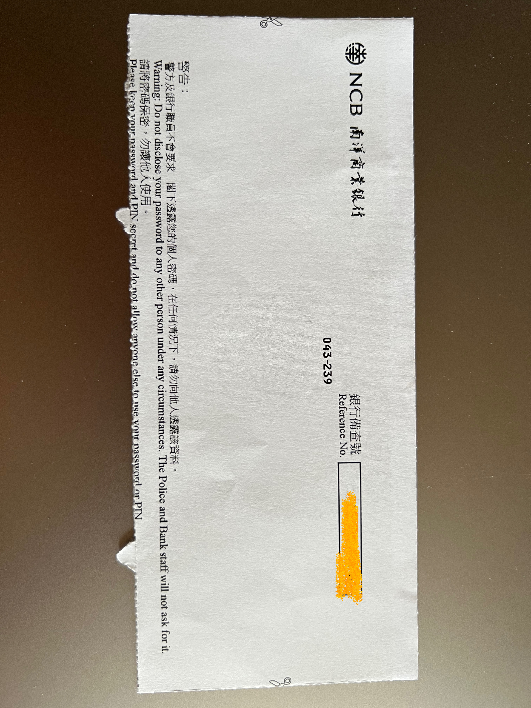
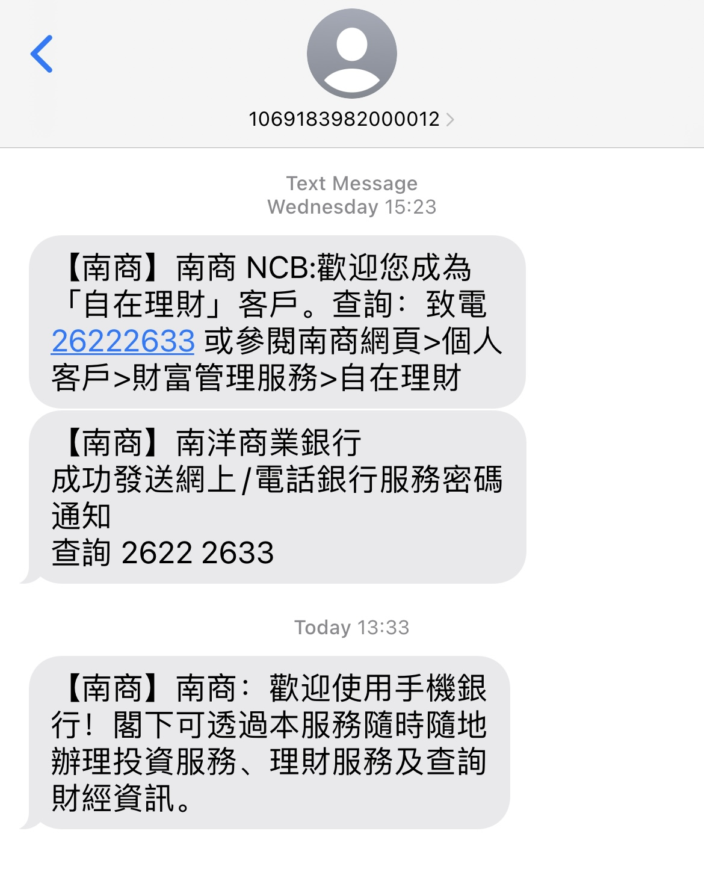

# 南洋商业银行

## 🎉结果
南洋商业银行，荃湾分行，提前在APP提交了申请，通过，只待去分行认证，预约荃湾分行4月2日15:00 - 17:00。排队等待1小时左右，15分钟认证完成，现在未拿提款卡、卡邮寄。等待提款卡邮寄中。

## 📜我准备的材料
✅ 身份证  
✅ 港澳通行证  
✅ 未用到⭕️ 过境小票 (小白条)  
✅ 未用到⭕️ 3月份的招行信用卡账单 (掌上生活-账单补寄-公章电子版，彩印)  
✅ 未用到⭕️ 过去6个月的代发工资行流水 (银行APP申请电子版，彩印)  
✅ 未用到⭕️ 过去6个月纳税记录 (个人所得税APP申请电子版，彩印)  

## 📽️开户过程
➡️ 在招商永隆开户完之后，步行不到2分钟到达分行。我到的时候没有保安，没有大堂经理。隔间里的经理都在打电话或者有客户，于是我看了取号机。取号机上有开户分行认证的号(看注意事项2)，于是取号等待。账户业务只有一个小哥在，有一个大妈办了50分钟，我前边1个号的大妈早就已经急了，坐立不安，找别的经理说。我也找了一个女经理，让我等待叫号就可以。小哥的普通话很好。  
➡️ 排队等候到号开始办理，同样我直接把老三样和账单、流水、纳税记录给小哥，小哥只要了身份证和通行证，要我打开南商e+ APP给他，接下来就是小哥复印证件、在我手机APP上进行分行认证流程、盖章签字，然后说等一下去拿密码纸，2 3分钟就回来了，跟我说了分行只能做认证，最终结果还需要几个工作日审批，审评通过后提款卡会在一个月左右寄到通讯地址，收卡后在内地南洋商业银行自助机激活就可以。  
➡️ 到此结束。离港前已收到短信和邮件审批通过。

## ❗️补充说明
1️⃣ 我是先在南商 e+ APP 上申请，只需要去分行认证然后等待审批。  
2️⃣ 取号机上有提示，荃湾分行的 C/F 开头号码都是户口相关的，叫号的时候都会叫，我先取的 F 号，提示也是 F 第一位，但小哥那一直叫 C ，所以我就又取了 C 号。  
3️⃣ 荃湾分行里有跨境客户开户的指引。

## 📸图片
### 南洋商业银行密码纸

### 南洋商业银行审批通过短信

