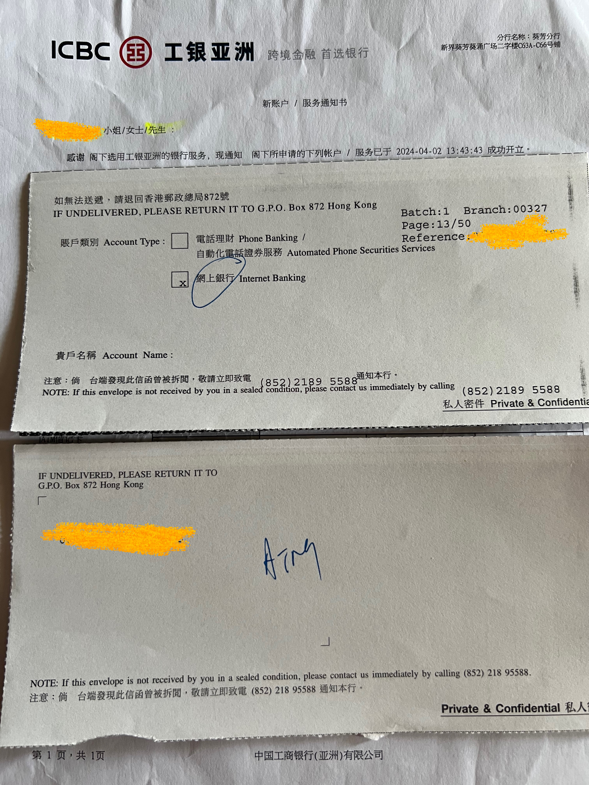

# 工银亚洲

## 🎉结果
工银亚洲，葵芳分行，预约4月2日12:00 - 13:00开户。无排队等待，45分钟开户完成，20分钟排队存款。4月12日挂号信收到提款卡。

## 📜我准备的材料
✅ 身份证  
✅ 港澳通行证  
✅ 未用到⭕️ 过境小票 (小白条)  
✅ 未用到⭕️ 3月份的招行信用卡账单 (掌上生活-账单补寄-公章电子版，彩印)  
✅ 未用到⭕️ 过去6个月的代发工资行流水 (银行APP申请电子版，彩印)  
✅ 未用到⭕️ 过去6个月纳税记录 (个人所得税APP申请电子版，彩印)  

## 📽️开户过程
➡️ 在汇丰香港开完户已经接近12点半了，估计招商永隆已经过号了，工银亚洲的预约时间也到了，就直奔葵芳先办工银亚洲。需要坐两站地铁，这家分行位置不好找，在葵涌广场2楼，里面全是小商铺，我到了2楼后，转了5分钟才找到，已经过了13:00了。  
➡️ 到达之后大堂没有工作人员，保安也不在，只有一个窗口在排队办业务。我于是问门口隔间的小哥说我预约了开户，小哥问我时间，我说12:00 - 13:00；问我名字，我说完他查了一下；问我预约编号是多少，我说完他查了一下说请坐，小哥的普通也很好。  
➡️ 同样我直接把老三样和账单、流水、纳税记录给小哥，但是小哥只要了身份证和港澳通行证。问我开户目的是什么，答投资理财；问我收入来源是什么，答主要是工作收入，这里理解岔了，小哥说不是这意思喔是你的资金是怎么香港，答主要是电汇，问是否需要开通网银和提款卡，答需要，小哥说需要存10000港币，我说带了港币现金。小哥给我他的名片，要我把地址信息发到他名片上的邮箱里，我提前准备了通讯地址、住宅地址、公司信息的简体中文、繁体中文、英文、拼音，所以直接复制就发过去了。然后就是小哥操作，复印证件、盖章签字，有另外一位经理来核对了下我的证件然后签字盖章，中间在小哥电脑上确认了下填写的信息是否正确，确认无误后小哥说等一下我去拿密码纸。  
➡️ 一会小哥回来把密码纸给我，说提款卡会邮寄到通讯地址，拿到提款卡后在内地工商银行的提款机上激活就可以了。并打印了一张账号明细信息，跟我说可以先拿着账号去存钱，因为现在人比较多，一会还需要再签几个字，于是我拿着账号纸去排队存款，排了20分钟才存上，排队的时候小哥已经拿文件过来给我签字了。存款完成我回到小哥那登录工银亚洲APP修改密码做了一些设置。  
➡️ 到此结束。

## ❗️补充说明
1️⃣ 我预约了不同时段的 4 家分行，只有 1 家分行打电话过来说他们分行已经预约到 7 月份了只好取消。  
2️⃣ 最初在官网预约提交后提示“系统维护中，请稍后重试”，重新填写，所有选填项一律不填、地址信息精简，这样提交就可以成功了。原因是提交接口是将表单加密后拼接到请求地址、表单内容过多会导致接口请求 414。  
3️⃣ 葵芳分行比较难找，在葵涌广场 2 层的一个商铺，注意葵涌广场是英式标准 G 层/1 层/2 层，2 层对应内地的 3 层，进入后上 2 次扶梯。

## 📸图片
### 工银亚洲密码纸

