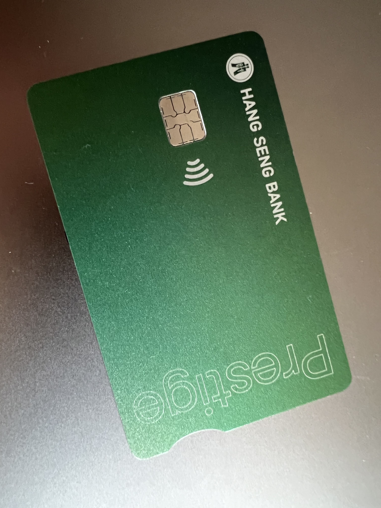

# 恒生银行

## 🎉结果
恒生银行，铜锣湾分行。预约铜锣湾分行4月3日09:00 - 10:00。无排队等待，30分钟开户完成，现场拿提款卡。

## 📜我准备的材料
✅ 身份证  
✅ 港澳通行证  
✅ 未用到⭕️ 过境小票 (小白条)  
✅ 未用到⭕️ 3月份的招行信用卡账单 (掌上生活-账单补寄-公章电子版，彩印)  
✅ 未用到⭕️ 过去6个月的代发工资行流水 (银行APP申请电子版，彩印)  
✅ 未用到⭕️ 过去6个月纳税记录 (个人所得税APP申请电子版，彩印)  

## 📽️开户过程
➡️ 4月3日9:40到达分行，在G层问保安和大堂经理，说直接去1层。上1层就有一个小哥站在接待台，我说预约了开户，小哥说稍等一下，然后他走了一会回来让我跟他走。小哥的普通话很好。  
➡️ 带我到一个小隔间，让我等待一下，他去拿个文件。1分钟回来了，我把老三样和账单、流水、纳税记录给小哥，小哥只要了身份证和通行证，问我通讯地址和身份证上的地址一样吗，我说不一样，小哥说那再稍等一下，我还要再去拿个文件。然后回来，小哥说本次申请是申请优越理财账户，100万资产免管理费，2年豁免期内免管理费，1年后资产不达标来港降级，账户也会有专属的经理对接我说可以的。政策限制账户无法开通美股，我说了解。  
➡️ 接下来就是小哥操作，在我手机啊恒生银行APP操作，中间让我输入了手机号、邮箱地址、详细地址部分，其它都是小哥操作，在一份文件手写了通讯地址，提示一定要以 中国+省份名 开头，然后就是签字，在小哥Pad上设置密码、确认信息什么的。完成之后小哥说等下我去拿卡，大概2 3分钟回来，跟我说一切都可以了。  
➡️ 到此结束。

## ❗️补充说明
1️⃣ 我提前一周在 4 月 2 号约了 1 家分行，可惜办其它行时间不够去了。4 月 3 号我分散时间约了 5 家分行，早上去铜锣湾第一家就办理成功。  
2️⃣ 我预约之前做了攻略，很多说恒生开户需要买保险、买理财才给开，所以我就预约了 6 家分行碰碰运气。  
3️⃣ 铜锣湾分行有跨境客户开户的指引。

## 📸图片
### 恒生银行提款卡

