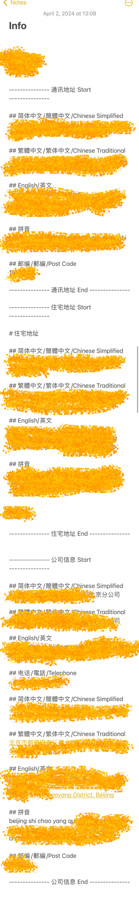
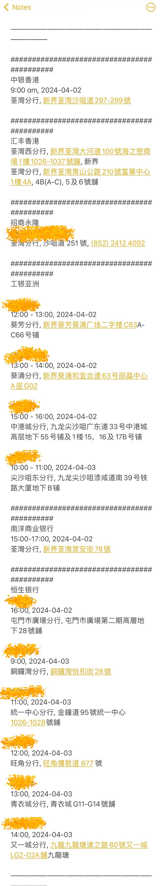
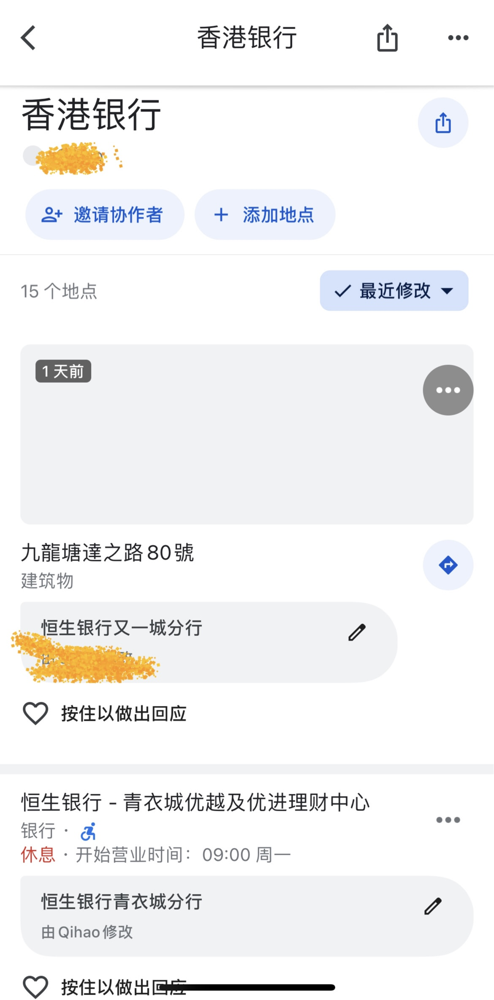

# 2024年4月香港银行卡开户总结

## 📽️说说我的经历：
开了6张卡，一天内开了5张，实际还挺累的。这6家银行我发布了6篇文章，可以参考。但是这些只是我的经历。  
➡️ [中银香港](https://io.fakebilly.com/blog/%E4%B8%AD%E9%93%B6%E9%A6%99%E6%B8%AF%E5%BC%80%E6%88%B7)  
➡️ [香港汇丰](https://io.fakebilly.com/blog/%E9%A6%99%E6%B8%AF%E6%B1%87%E4%B8%B0%E5%BC%80%E6%88%B7)  
➡️ [工银亚洲](https://io.fakebilly.com/blog/%E5%B7%A5%E9%93%B6%E4%BA%9A%E6%B4%B2%E5%BC%80%E6%88%B7)  
➡️ [招商永隆](https://io.fakebilly.com/blog/%E6%8B%9B%E5%95%86%E6%B0%B8%E9%9A%86%E5%BC%80%E6%88%B7)  
➡️ [南洋商业银行](https://io.fakebilly.com/blog/%E5%8D%97%E6%B4%8B%E5%95%86%E4%B8%9A%E9%93%B6%E8%A1%8C%E5%BC%80%E6%88%B7)  
➡️ [恒生银行](https://io.fakebilly.com/blog/%E6%81%92%E7%94%9F%E9%93%B6%E8%A1%8C%E5%BC%80%E6%88%B7)  

## ☎️准备
➡️ 3 月就关注好了香港公众假期，各家银行营业时间，确定了清明 8 天假期，4 月 2 号办理、4 月 3 号补漏。  
➡️ 提前预约，除了汇丰提前一周预约没有约上，其它几家银行我每家都有预约或者申请，每家办理都很丝滑。  
➡️ 提前做好了功课，预约了相互临近的分行。除了工银亚洲我预约的远一些，其它几家都是相互步行最多 10 分钟以内就到的。我每家分行都提前在 Google 地图上标记收藏了地点，预估了银行之间的线路，在 Notes 上记录了分行名称、地址、预约时间，提前做好了规划。    
➡️ 提前下载好了各家银行 APP 。

## 💵换汇
➡️ 国内换汇了 31,500 港币，其中 500 作为消费零钱用，其余开户存入银行。

## 📜相关文件
➡️ 地址证明、过去半年工资行流水、过去半年纳税记录文件我每一样彩印了 6 份、对应 6 家银行。  

## 📸图片
### Notes 个人简体、繁体、英文、拼音信息

### Notes 银行分行预约记录

### Google Map 银行分行地点提前收藏

