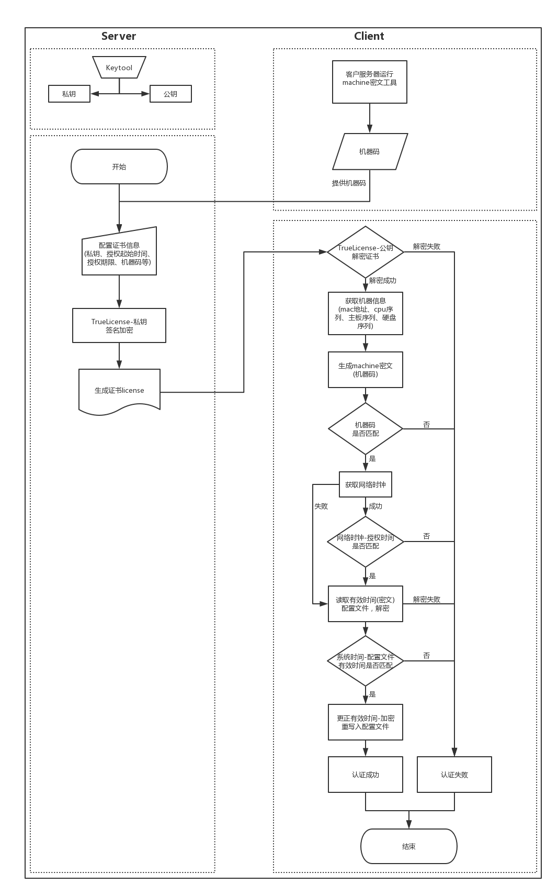
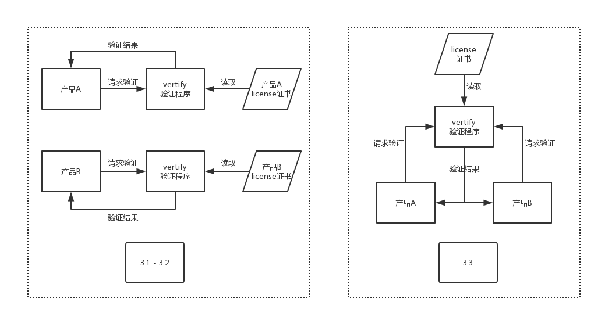

# License 授权认证 <!-- {docsify-ignore-all} -->

## 1. 前言

### 1.1 简介

根据公司需求做的 demo，产品多为 jar 包、war 包，对比客户端做授权灵活性较弱，以后做成 SDK 封装到产品中

**代码：**[GitHub](https://github.com/fakebilly-dev/license)

### 1.2 模块
1. **machine-generate**
* ```jar```包，在产品运行机器上生成机器码
2. **license-server**
* 生成```license```证书```license.lic```
3. **license-client**
* 验证```license```证书

## 2. 特性
1. 使用```keytool```工具生成非对称性密钥对，私钥签名加密、公钥解密
2. 采集机器硬件信息（mac地址、cpu序列、主板序列、硬盘序列），限制程序运行机器
3. 定义授权起始时间，对网络时钟、系统时钟、配置文件时间同步验证，完成授权需求
4. 使用```truelicense```开源证书管理引擎，生成授权证书
5. 对```license```业务代码混淆加密，防止反编译跳过、替换验证过程

## 3. 授权方案


## 4. 流程图
