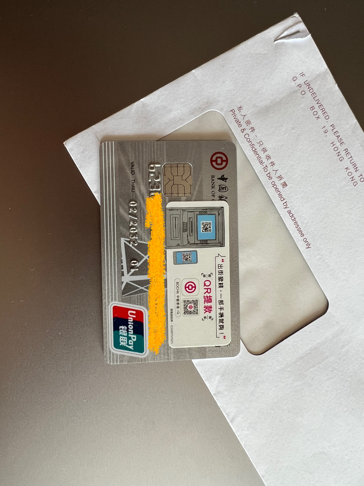

# 中银香港

## 🎉结果：
中银香港，荃湾分行，预约的4月2日09:00。无排队等待，43分钟开户完成，现场拿提款卡。  

## 📜我准备的材料：
✅ 身份证  
✅ 港澳通行证  
✅ 过境小票 (小白条)  
✅ 3月份的招行信用卡账单 (掌上生活-账单补寄-公章电子版，彩印)  
✅ 过去6个月的代发工资行流水 (银行APP申请电子版，彩印)  
✅ 过去6个月纳税记录 (个人所得税APP申请电子版，彩印)  

## 📽️开户过程
➡️ 早上8点半到银行门口排队，前边已经有3个老大爷在排队了。9点银行开门，跟着队伍进去，直接跟大堂经理说我预约了开户，给她看了预约邮件，她说9点可以你是第一个，问我有没有带1000港币、开户完成需要存入，我说带了，然后让我先下载BOC香港扫码填写资料，带我去坐门口的小桌那，让我填完找她。BOC 香港和BOC Pay我已经提前下载好了。  
➡️ 就是填写一些个人信息，填写完成找到大堂经理，带我去了旁边的小隔间，接待的理财经理是一个小哥，普通话很好。我直接把老三样和账单、流水、纳税记录给他了。小哥看了一下证件和文件，问开户目的，答投资理财；问有无投资经验，答买过基金和银行理财产品；问需要开通投资账户吗，答需要。  
➡️ 接下来就是小哥操作，复印证件、在电脑录入信息，有另外一位经理来核对了下我的证件然后签字盖章，引导我在他电脑上填一下投资风险问卷，最后跟我核对了一下电脑上录入的信息，确认之后小哥说稍等他去拿张提款卡。  
➡️ 一会拿着提款卡回来了，闲聊了几句问我什么时候来的香港、什么时候回去。小哥又在电脑上操作，结束之后跟我说了一些告知事项，给了三本条款小册子，引导我开通了BOC Pay，让我离开香港前去自助取款机插卡查询余额激活一下提款卡。  
➡️ 到此结束，去外边自助存款机存了1000港币。  

## ❗补充说明
1️⃣ 中银预约是可以预约 7 天后的第一个工作日或者周六营业日，0 点 5 分之前各预约时段基本都有位置。我 3 月 21 号就预约到了 4 月 2 号。  
2️⃣ 中银香港荃湾分行无预约不给开户。我开户期间遇到 3 个人来问没有预约能否开户都被拒绝了。

## 📸图片
### 中银香港提款卡

