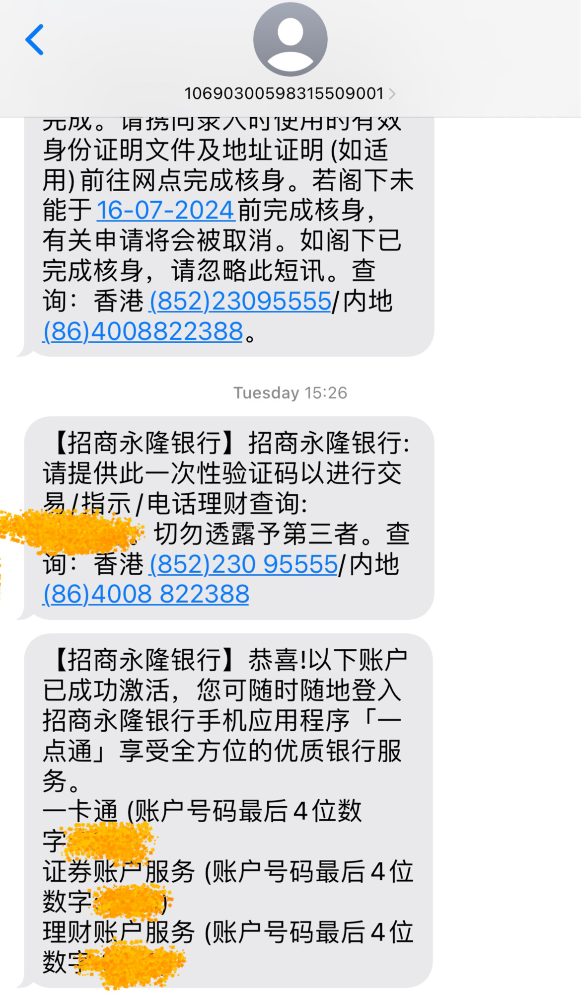

# 招商永隆

## 🎉先说结果：
招商永隆，荃湾分行，3月份已经在APP提交了申请，通过，只待去分行激活，无需再预约分行和时间。4月2日，排队等待1小时10分钟左右，20分钟激活完成，现在未拿提款卡、卡邮寄。等待提款卡邮寄中。

## 📜我准备的材料：
✅ 身份证  
✅ 港澳通行证  
✅ 过境小票 (小白条)  
✅ 未用到⭕️ 3月份的招行信用卡账单 (掌上生活-账单补寄-公章电子版，彩印)  
✅ 未用到⭕️ 过去6个月的代发工资行流水 (银行APP申请电子版，彩印)  
✅ 未用到⭕️ 过去6个月纳税记录 (个人所得税APP申请电子版，彩印)  

## 📽️开户过程
➡️ 在工银亚洲开户完之后，坐地铁回来分行已经3点10分左右了，这家分行只有2个隔间，我中午取的号已经过了很多，正巧小姐姐刚办完1个，我就探头问了下我能办吗，小姐姐说你已经过号很久了，需要重新叫号，于是我重新取号，号码为G (看注意事项2)，前面排8个人。另外1个隔间的小哥已经休息了，所以只剩1个隔间，小姐姐的普通话很好。  
➡️ 排队等候到号开始办理，同样我直接把老三样和账单、流水、纳税记录给小姐姐，小姐姐只要了老三样，问开户目的是什么，答投资理财；问月收入多少，答如实；问将来会有多少资金注入，答每半年会有5w人民币等值港币进来；问有带港币现金吗，答带了10000港币在激活完成后存入。接下来就是小姐姐复印证件、跟我核对信息、盖章签字。最后小姐姐说激活完成了，提款卡会需要一个月左右邮寄到通信地址，柜台存款人比较多，建议去外边自助机存款。外面只有一个自助机，还排队，于是我先去南洋商业银行开户回来再存款，没有排队，直接存入10000 港币。  
➡️ 到此结束。

## ❗️注意事项
1️⃣ 一定要在招商永隆APP上申请，等待申请通过就可以直接去分行激活。我在排队等候期间有5位因为没有提前申请，被小姐姐拒绝开户和激活。  
2️⃣ 取号机上有提示，荃湾分行的 G/H/I 开头号码都是开户相关的，叫号的时候都会叫，我不确定顺序，但基本是 G H I 轮流叫。所以去取号的时候看取号机说明，跟开户相关的每个都取一张。  
3️⃣ 建议早去。我在3点40左右排队等候的时候小姐姐和引导的工作人员已经开始自己取号了，把后面时间点的号取掉了，再之后的号码当天办理不了了。

## 图片
### 招商永隆激活成功短信

