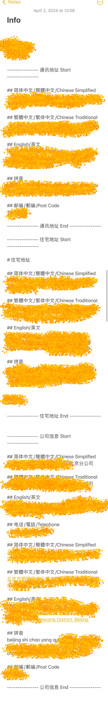

# 2024年4月香港银行卡开户总结

## 📽️说说我的经历：
开了6张卡，一天内开了5张，实际还挺累的。这6家银行我发布了6篇文章，可以参考。但是这些只是我的经历。  
➡️ [中银香港](https://kb.fakebilly.com/#/bankcard/Bank_of_China_Hong_Kong)  
➡️ [香港汇丰](https://kb.fakebilly.com/#/bankcard/HSBC_HK)  
➡️ [工银亚洲](https://kb.fakebilly.com/#/bankcard/ICBC_Asia)  
➡️ [招商永隆](https://kb.fakebilly.com/#/bankcard/CMB_Wing_Lung_Bank)  
➡️ [南洋商业银行](https://kb.fakebilly.com/#/bankcard/NCB_HK)  
➡️ [恒生银行](https://kb.fakebilly.com/#/bankcard/Hang_Seng_Bank)  

## ☎️预约
➡️ 提前关注好香港公众假期，各家银行营业时间，以免跑空。  
➡️ 提前预约，没有预约或者预约不上就找可以walk-in的分行，在预约时间去分行办理；招商永隆、南洋商业提前在APP上申请，审批通过后到分行后激活认证就会很顺利。除了汇丰，其它几家银行我每家都有预约或者申请、每家都很顺利。  
➡️ 香港银行很多，一条街上、邻近街上基本都有各家银行，所以预约的时候提前做好功课，预约临近的分行，否则来回跑的话很耽误时间。除了工银亚洲我预约的远一些，其它几家都是相互步行10分钟以内就到的。我每家分行都提前在Google地图上标记收藏了地点，银行之间的线路，在note上记录了分行名称、地址、预约时间，提前做好了规划。    
➡️ 提前下载好各家银行APP。

## 💵再说换汇
➡️ 国内换汇取钞差价损失最小，而且方便。香港路边换汇店有很多，但是汇率很差，差价高不少，有没有其它费用我因为没有换过所以不清楚；多带几张银联卡，在有银联标识的提款机上取港币，按实时汇率+1%手续费，一家银行一次取款额度一天取款次数有限制，取得多的话多带几张卡。

## 💰接下来说携带现金限制
➡️ 15天内第一次出镜，最高可以携带2w人民币或者5000美元等值外币，注意超过这个数、需要办理携带证、很麻烦。  
➡️ 15天内第二次或以上出镜，最高只能携带1000美元等值外币，注意超过这个数、需要办理携带证、很麻烦。

## 📜还有相关文件
➡️ 入境香港时的小白条，不要丢弃，保存好，开户需要使用。  
➡️ 地址证明，一般通讯地址和身份证地址不同需要，但是我建议都准备好，关于打印黑白还是彩色，这个看攻略说随意，但我打印的彩色的、总没有错；其它文件比如工资流水、理财/基金证明、纳税记录什么的，至少要有公章电子版。这些文件我每一样都打印了6份、对应一家银行，做足了准备。

## 📎补充点别的
➡️ todo...

## 图片
### Notes 个人简体、繁体、英文、拼音信息

### Notes 银行分行预约记录

### Google Map 银行分行地点提前收藏

